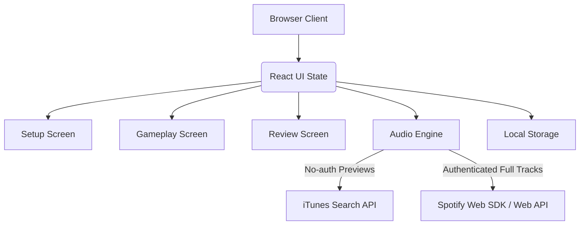
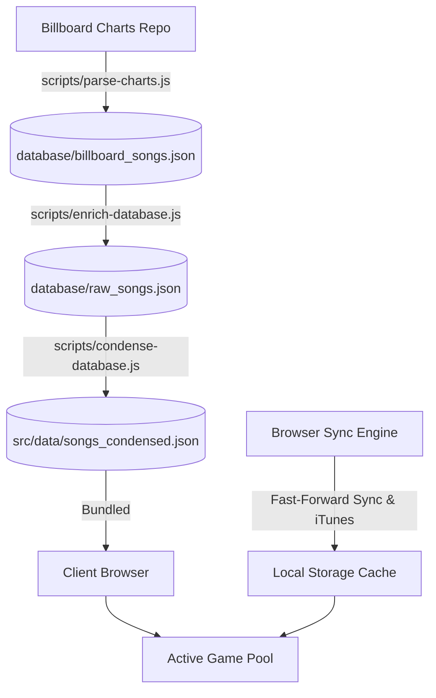
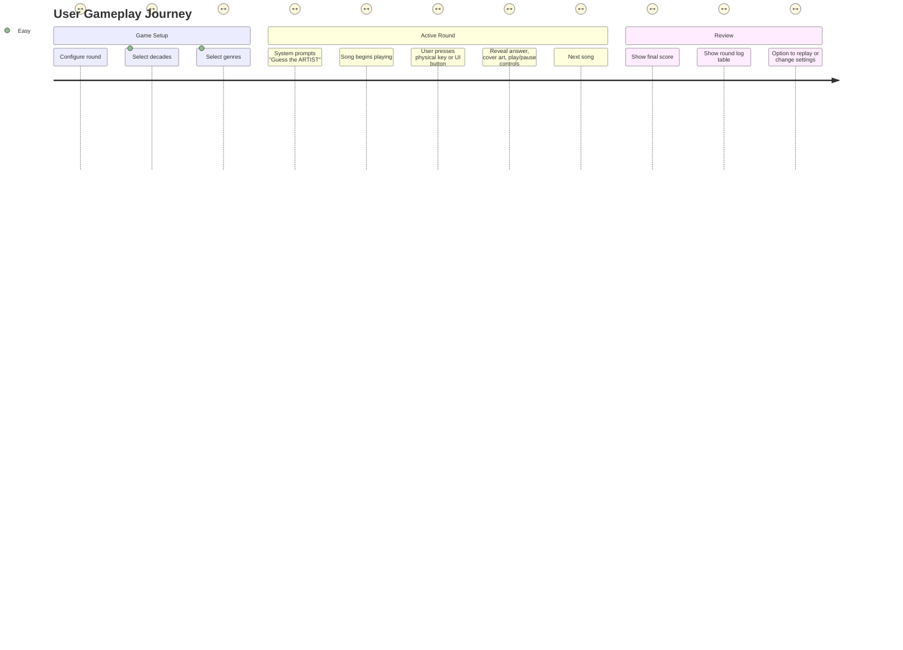

# Name That Tune Trainer - System Design Document

This document outlines the proposed design and architecture for the **Name That Tune Trainer** application.

---

## 1. Technical Stack & Architecture

We propose a **Client-Side Single Page Application (SPA)** built with:

- **Frontend Framework**: React (via Vite + TypeScript) for robust component-based UI and reactive state management.
- **Styling**: Modern Vanilla CSS with CSS Variables for themes, flexbox/grid for layouts, and glassmorphic designs with smooth transitions.
- **State Management**: React Context / Hooks for managing trivia round states, history logs, and user settings.
- **Storage**: `localStorage` to persist custom settings, custom song lists, and high scores/history across sessions.
- **Deployment**: Can be built as static HTML/CSS/JS files and served from GitHub Pages, Vercel, Netlify, or run locally without any backend server.



---

## 2. Playback Options: iTunes vs. Spotify

A core technical challenge is playing copyrighted music without a dedicated backend server. The application implements a unified playback abstraction supporting both engines:

| Feature              | iTunes Search API (Default Fallback)  | Spotify Web Playback SDK                          |
| :------------------- | :------------------------------------ | :------------------------------------------------ |
| **Authentication**   | **None** (Public endpoints)           | OAuth User Login (via User Client ID)             |
| **Cost / Access**    | **Free** for all users                | Requires **Spotify Premium** account              |
| **Playback Content** | 30-second audio previews (AAC format) | Full-length songs starting from 0:00              |
| **Browser Support**  | Native HTML5 `<audio>` element        | Spotify Web Playback SDK (virtual Connect player) |
| **Artwork/Metadata** | High-resolution cover art included    | High-resolution cover art included                |
| **Setup Overhead**   | **Zero** setup                        | Pasting a free Developer Client ID                |

### Unified Playback Flow

The Audio Playback engine abstracts the active driver at runtime:

1. **iTunes Mode**: Initiates a native `<audio>` element loading the iTunes AAC 30s preview clip.
2. **Spotify Mode**:
   - **OAuth PKCE flow**: The app generates a cryptographically random code verifier and computes its SHA-256 code challenge. It redirects the user to `https://accounts.spotify.com/authorize` with `response_type=code` and the code challenge. On redirect back, the app exchanges the temporary auth code for an access token and refresh token directly with Spotify's token endpoint (`https://accounts.spotify.com/api/token`) without requiring a client secret. This supports the default authorization settings for all newly registered Spotify dashboard apps. Also supports auto-refreshing expired tokens in the background.
   - **SDK Lifecycle**: Loads `https://sdk.scdn.co/spotify-player.js` dynamically, instantiates a virtual playback speaker device named _"Name That Tune Trainer"_, and connects to Spotify's server.
   - **Search & Stream**: During gameplay, the app queries the Spotify Search API using the track title and artist to retrieve its native URI (e.g. `spotify:track:xxx`), then commands the Spotify device to stream that track starting from **0:00 (the very beginning)**.
   - **iTunes Fallback**: If a song is not found in Spotify's catalog, or if the user's Spotify connection fails/expires, the system automatically falls back to playing the iTunes 30s preview for that round. This guarantees gameplay is never interrupted.

---

## 3. Answer Matching Engine (The First-Letter Rule)

The core mechanic of "Name That Tune" trivia requires teams to submit the **first letter** of the requested answer (Artist or Title), skipping articles ("a", "an", "the").

### Normalization & A-Z Filtering

When processing song metadata, the system extracts the first letter using the following algorithm:

1.  Convert the string to lowercase.
2.  Strip leading whitespace and special characters (e.g., `"..."`, `"`", `(`, `#`).
3.  Remove leading articles: `^a\s+`, `^an\s+`, `^the\s+`.
4.  Extract the first remaining character.
5.  **A-Z Constraint**: Check if the character is in the range `[a-z]`. If the first character of the normalized title **or** artist is a number or symbol, the song is skipped and excluded from the database entirely. This allows for a clean, static A-Z keyboard interface.

**Examples:**

- `"The Beatles"` $\rightarrow$ `"beatles"` $\rightarrow$ **B** (Valid)
- `"A Hard Day's Night"` $\rightarrow$ `"hard day's night"` $\rightarrow$ **H** (Valid)
- `"...Baby One More Time"` $\rightarrow$ `"baby one more time"` $\rightarrow$ **B** (Valid)
- `"An Old Fashioned Love Song"` $\rightarrow$ `"old fashioned love song"` $\rightarrow$ **O** (Valid)
- `"24K Magic"` $\rightarrow$ `"24k magic"` $\rightarrow$ **2** (Excluded)
- `"50 Cent"` $\rightarrow$ `"50 cent"` $\rightarrow$ **5** (Excluded)

---

## 4. Song Database Strategy

Since no external server is required, we need a reliable way to generate and update the song database without external LLM dependencies.

### 1. Three-Tier Database Architecture

To enable offline testing of parsing, deduplication, and popularity filtering without triggering any external iTunes Search API requests, we will implement a three-tier database pipeline:



#### Tier A: Raw Billboard Songs List (`database/billboard_songs.json`)

- **Purpose**: A checked-in list of _every_ unique song that has charted on the Billboard Hot 100, alongside its lifetime cumulative peak position and weeks on chart. Contains **zero API metadata**.
- **Benefits**: Allows debugging parser boundaries, deduplication logic, and popularity thresholds entirely offline in milliseconds without hitting rate limits.
- **Structure**:
  ```json
  {
    "metadata": {
      "lastUpdatedChartDate": "2026-06-20"
    },
    "songs": [
      {
        "title": "Billie Jean",
        "artist": "Michael Jackson",
        "peak_position": 1,
        "weeks_on_chart": 24
      }
    ]
  }
  ```

#### Tier B: Raw Enriched Database (`database/raw_songs.json`)

- **Purpose**: The checked-in, complete database containing the raw iTunes API lookup responses for songs. We only run API queries for songs that are new to this layer.
- **Structure**:
  ```json
  {
    "songs": [
      {
        "title": "Billie Jean",
        "artist": "Michael Jackson",
        "peak_position": 1,
        "weeks_on_chart": 24,
        "itunes": {
          "trackId": 268896500,
          "primaryGenreName": "Pop",
          "releaseDate": "1982-11-30T00:00:00Z",
          "previewUrl": "https://audio-ssl.itunes.apple.com/...aac.p.m4a",
          "artworkUrl100": "https://is1-ssl.mzstatic.com/...100x100bb.jpg"
        }
      }
    ]
  }
  ```

#### Tier C: Condensed Client Database (`src/data/songs_condensed.json`)

- **Purpose**: The lightweight, bundled file served to the client browser, containing only essential properties.
- **Structure**:
  ```json
  {
    "metadata": {
      "lastUpdatedChartDate": "2026-06-20"
    },
    "songs": [
      {
        "title": "Billie Jean",
        "artist": "Michael Jackson",
        "decade": "1980s",
        "genres": ["Pop"],
        "previewUrl": "https://audio-ssl.itunes.apple.com/...aac.p.m4a",
        "artworkUrl": "https://is1-ssl.mzstatic.com/...100x100bb.jpg"
      }
    ]
  }
  ```

---

## 2. Database Scripts

#### A. Chart Parser (`scripts/parse-charts.js`)

- **Input**: Downloads/scrapes the raw weekly Billboard JSON chart files from the GitHub archive dataset.
- **Output**: Deduplicates the song list and outputs the updated `database/billboard_songs.json`.
- **Behavior**: Zero API requests. Safe to run, modify, and inspect repeatedly during development.

#### B. Database Enricher (`scripts/enrich-database.js`)

- **Input**: Reads `database/billboard_songs.json` and `database/raw_songs.json`.
- **Behavior**:
  1.  Compares the two files and isolates any songs that exist in the Billboard list but lack iTunes metadata in `raw_songs.json`.
  2.  For these new songs, it queries the iTunes Search API (throttled to 2,000 queries/hour) to fetch full track metadata.
  3.  Appends the results to `database/raw_songs.json` and saves it.
- **Benefit**: Saves money and rate-limit allocations by never querying songs we have already resolved.

#### C. Database Condenser (`scripts/condense-database.js`)

- **Input**: Reads `database/raw_songs.json`.
- **Behavior**:
  1.  Filters songs based on the current active popularity filters (e.g. `peak_position <= 20` or `weeks_on_chart >= 16`).
  2.  Condenses the payload by extracting only key fields (`title`, `artist`, `decade`, `genres`, `previewUrl`, `artworkUrl`).
  3.  Writes the outcome to `src/data/songs_condensed.json` for the client build.

---

## 3. Browser Client Runtime "Fast-Forward" (Serverless Sync)

When a user opens the application, it syncs the condensed database with new weekly charts:

1.  **State Check**: Reads `lastUpdatedChartDate` from the client's `songs_condensed.json` and loads `localStorage.cached_dynamic_songs`.
2.  **Date Comparison**: Fetches `valid_dates.json` from the Billboard dataset repo.
3.  **Process Updates**: For any weeks newer than the static database:
    - Downloads the missing weekly JSON chart files.
    - Filters songs using the active popularity criteria.
    - Deduplicates them against the static database and `localStorage`.
4.  **Fetch & Cache**: Queries the iTunes Search API for these new songs, maps them to the **condensed** format, and caches them in `localStorage.cached_dynamic_songs`.
5.  **Merge Pool**: Combines static condensed songs with cached updates during gameplay.

- **Result**: Development and testing are 100% safe, fast, and local, while the client application remains extremely lightweight.

> [!NOTE]
> **Handling Boundary-Spanning Songs**:
> Because the weekly Billboard Hot 100 JSON files store _cumulative_ statistics for each song (meaning every entry includes the song's lifetime `peak_position` and lifetime `weeks_on_chart` up to that date), the sync engine does not need to download historical weekly files to evaluate songs whose chart runs span across the pre-processed and new data.
>
> If a song starts charting before the built-in database was compiled (e.g., week 10) and continues afterward, the new weekly files downloaded by the browser will list the song with its cumulative weeks (e.g., week 11, 12, etc.). The moment it meets the popularity threshold, the sync engine detects it, finds it missing from the built-in list, and enriches/caches it.

---

## 5. UI/UX Design & Screens

We aim for a sleek, premium, dark-mode-first aesthetic with fluid micro-animations.



### 1. Setup Screen

- **Decades Selector**: Multiselect buttons (60s, 70s, 80s, 90s, 00s, 10s, 20s).
- **Genres Selector**: Multiselect chips (Pop, Rock, Hip Hop, Country, Electronic, R&B, etc.).
- **Prompt Filter**: Guess Title, Guess Artist, or Alternate.
- **Round Length**: Slider/inputs (10, 20, 50, Custom).
- **Start Button**: Pulse animation.

### 2. Gameplay Screen

- **Header**: Progress bar (e.g., "Song 4 of 10"), Current Score (e.g., "Score: 3/3").
- **Central Card**: Glassmorphism panel displaying:
  - Prompt: `"GUESS THE ARTIST"` or `"GUESS THE SONG TITLE"` (large, pulsing text).
  - Visualizer: A subtle, looping CSS wave animation that pulses while music is playing.
- **Input Interface**:
  - A-Z grid of circular buttons for tap/click interfaces.
  - Physical keyboard listener (pressing a key immediately registers it).
- **Feedback Overlay (Post-Answer)**:
  - Correct/Incorrect banner (Green/Red glow).
  - Song Reveal: Large album artwork, Song Title, and Artist name.
  - Audio Playback Controls: Standard play/pause and scrub bar for the preview.
  - "Next Song" button.

### 3. Review Screen

- **Summary Stats**: Circular score ring (e.g., "80% Correct"), average reaction speed.
- **History Table**: A clean table showing:
  - Artwork preview.
  - Song & Artist.
  - Guess Type (Title vs Artist).
  - User's Guess (e.g., **M**) vs Correct Answer (e.g., **M** - Michael Jackson).
  - Status Icon (Check/Cross).
  - Mini play button to re-listen.
- **Call-to-Actions**: "Play Again" (same settings) or "Back to Setup".
